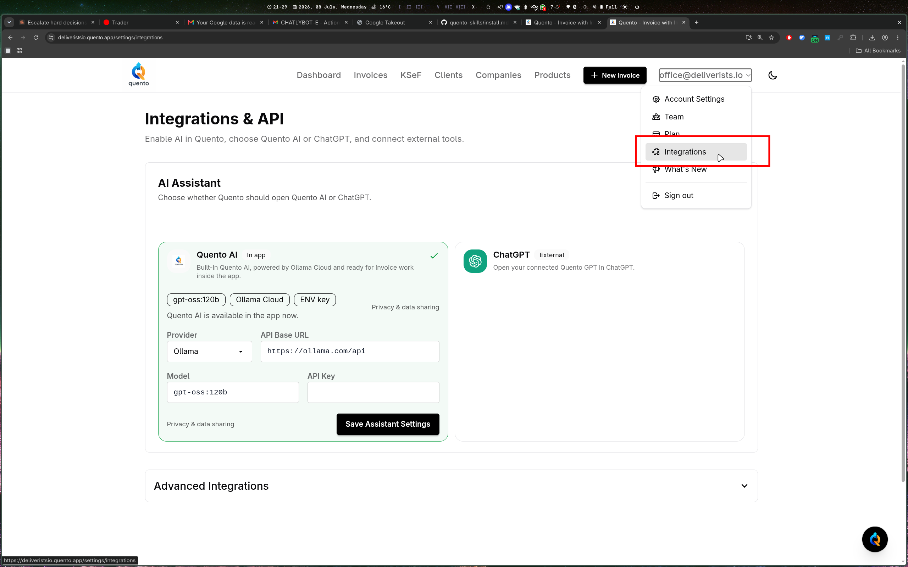
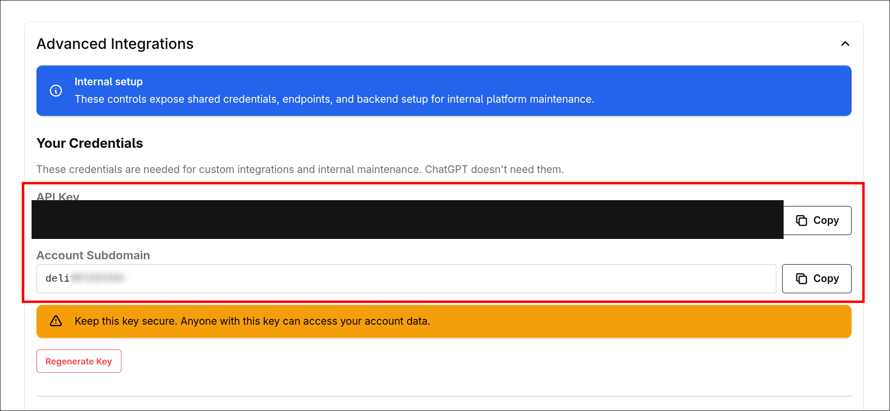

I want you to install Agent Skills for Quento for me. Execute all steps autonomously.

OBJECTIVE: Install Quento agent skills so your agent can manage invoices, clients, analytics, and KSeF via the Quento MCP server.

DONE WHEN: The quento skill is installed, the Quento MCP server is configured in the agent's config file, and — after the user authorizes Quento in their browser — the agent can call Quento tools (e.g. it lists real invoices when asked).

## TODO

- [ ] Configure the Quento MCP server connection
- [ ] Install skill docs
- [ ] Restart, authenticate in the browser, verify

## Step 1: Connect the Quento MCP server

Quento uses standard MCP OAuth — **no API keys to copy**. Add the server, and your agent will open the browser for you to sign in and approve.

For Claude Code, one command:

```bash
claude mcp add --transport http --scope user quento https://quento.app/mcp
```

(`--scope user` makes it available in every project; drop it to configure just the current one.)

Or edit the MCP client config directly — `~/.claude.json` under `mcpServers` for Claude Code, or a project-level `.mcp.json`; other MCP clients (Cursor, VS Code, Goose, …) have an equivalent file:

```json
{
  "mcpServers": {
    "quento": {
      "type": "http",
      "url": "https://quento.app/mcp"
    }
  }
}
```

That's the whole config — no headers, no secrets, no subdomain. Authentication happens in Step 3.

Don't have a Quento account yet? Register at `https://www.quento.app` first (the browser sign-in in Step 3 needs an account to sign in to).

## Step 2: Install skill docs

```bash
npx skills add DeliveristsIO/quento-skills
```

This installs the Quento skill into your agent using the [Agent Skills](https://agentskills.io) standard. The installer auto-detects your agent (Claude Code, Cursor, Codex, VS Code, Goose, Amp, and others).

To install for a specific agent:

```bash
npx skills add DeliveristsIO/quento-skills -a claude-code
```

To install globally (available across all projects):

```bash
npx skills add DeliveristsIO/quento-skills -g
```

**Verify:**
```bash
npx skills list
# Expected: quento skill listed
```

## Step 3: Restart, authenticate, verify

MCP servers connect when your agent starts, so restart your agent session now.

Authentication is a browser step only the user can do — if you are an agent executing this file, tell the user to do the following and wait:

1. In Claude Code, run `/mcp`, select **quento**, and choose **Authenticate**. (Other MCP clients show their own "needs authentication" prompt for the server.)
2. The browser opens Quento — sign in and click **Authorize**.

That's it — tokens are stored by your MCP client and renew automatically; you won't be asked again on this machine.

Then verify: ask the agent something like *"list my Quento invoices"* — if it responds with real data instead of an error, the connection works.

EXECUTE NOW: Start with Step 1. Mark TODO items complete as you go. Stop once Step 3's verification succeeds (you will need the user to complete the browser authorization in Step 3).

---

## Other agents

Quento implements standard MCP authorization, so any MCP client that supports OAuth works the same way: add `https://quento.app/mcp` as a remote/HTTP server, authenticate in the browser when prompted. Agent-specific notes:

- **Codex**: `codex mcp add quento --url https://quento.app/mcp`, then `codex mcp login quento`
- **OpenCode**: add to `opencode.json` under `"mcp"`: `"quento": { "type": "remote", "url": "https://quento.app/mcp" }` — the OAuth flow starts automatically on first use (manual trigger: `opencode mcp auth quento`)
- **Cursor / VS Code**: add the URL to `.cursor/mcp.json` / `.vscode/mcp.json` and click **Authenticate** when the editor flags the server as needing login
- **Agents that only support stdio MCP servers**: use the [`mcp-remote`](https://www.npmjs.com/package/mcp-remote) shim as the server command — `npx mcp-remote https://quento.app/mcp` — it proxies stdio↔HTTP and performs the browser OAuth itself
- **Agents without MCP support** (e.g. pi) **and headless/CI machines**: use the API key fallback below

---

## Fallback: API key authentication

**Use this only if** the machine has no browser (SSH boxes, CI), your MCP client doesn't support OAuth for MCP servers, or you want to script the API directly with `curl`.

### Get your API key and subdomain

1. Sign in to your Quento account at `https://www.quento.app`

2. Click your **account email** in the top-right of the nav bar → **Integrations**



3. Scroll down and expand **Advanced Integrations** → **Your Credentials**, then copy the **API Key** and the **Account Subdomain**



Anyone with the API key has full access to the account's data — never commit it or a screenshot of it. If it ever leaks, click **Regenerate Key** on that same screen.

### Configure with the key

Unlike the OAuth setup above, API keys require your **account subdomain** in the URL (`https://quento.app/mcp` rejects them):

```json
{
  "mcpServers": {
    "quento": {
      "type": "http",
      "url": "https://yourcompany.quento.app/mcp",
      "headers": {
        "Authorization": "Bearer your-api-key-here"
      }
    }
  }
}
```

Replace `yourcompany` with your **Account Subdomain** and `your-api-key-here` with your **API Key**. This config file lives on your machine only; it's not part of any project repo, so pasting the key directly here is fine.

> **Prefer not to store the key in a plaintext config file?** Set it as an environment variable instead — `QUENTO_API_KEY` on macOS/Linux (`export QUENTO_API_KEY="..."` in `~/.zshrc` or `~/.bashrc`, then `source` it) or Windows (`setx QUENTO_API_KEY "..."` in PowerShell, then open a new terminal) — and reference it as `"Authorization": "Bearer ${QUENTO_API_KEY}"` instead of the literal key. `${VAR}` expansion support depends on your MCP client; Claude Code supports it.

<details>
<summary>Advanced: verify the MCP server directly, without restarting</summary>

This drives the server over raw HTTP (JSON-RPC), useful for troubleshooting or for an autonomous agent that wants to confirm the key/subdomain are correct before a restart:

```bash
URL="https://yourcompany.quento.app/mcp"   # your subdomain from above
SID=$(curl -sS -D - -o /dev/null -X POST "$URL" \
  -H "Authorization: Bearer $QUENTO_API_KEY" \
  -H "Content-Type: application/json" -H "Accept: application/json, text/event-stream" \
  -d '{"jsonrpc":"2.0","id":1,"method":"initialize","params":{"protocolVersion":"2025-06-18","capabilities":{},"clientInfo":{"name":"install-check","version":"1.0"}}}' \
  | tr -d '\r' | awk -F': ' 'tolower($1)=="mcp-session-id"{print $2}')
curl -sS -o /dev/null -X POST "$URL" \
  -H "Authorization: Bearer $QUENTO_API_KEY" -H "Content-Type: application/json" \
  -H "Accept: application/json, text/event-stream" -H "Mcp-Session-Id: $SID" \
  -d '{"jsonrpc":"2.0","method":"notifications/initialized"}'
curl -sS -X POST "$URL" \
  -H "Authorization: Bearer $QUENTO_API_KEY" -H "Content-Type: application/json" \
  -H "Accept: application/json, text/event-stream" -H "Mcp-Session-Id: $SID" \
  -d '{"jsonrpc":"2.0","id":2,"method":"tools/list","params":{}}' | grep -o 'list_invoices_tool'
```

Expected output: `list_invoices_tool`. If the key or subdomain are wrong, you'll get an auth error instead. This requires `QUENTO_API_KEY` to be set as an environment variable (see the callout above) — or just substitute your literal key into the `-H "Authorization: Bearer ..."` lines.

</details>

---

## Optional: Manual installation

**Do not execute this section unless explicitly requested.**

Clone this repo and symlink skills into your agent's skill directory:

```bash
git clone https://github.com/DeliveristsIO/quento-skills ~/.quento-skills
mkdir -p ~/.claude/skills
ln -sfn ~/.quento-skills/skills/quento ~/.claude/skills/quento
```

For per-project installation:

```bash
mkdir -p .claude/skills
ln -sfn ~/.quento-skills/skills/quento .claude/skills/quento
```

Update with:
```bash
cd ~/.quento-skills && git pull
```

Symlinks pick up changes immediately without reinstalling.
